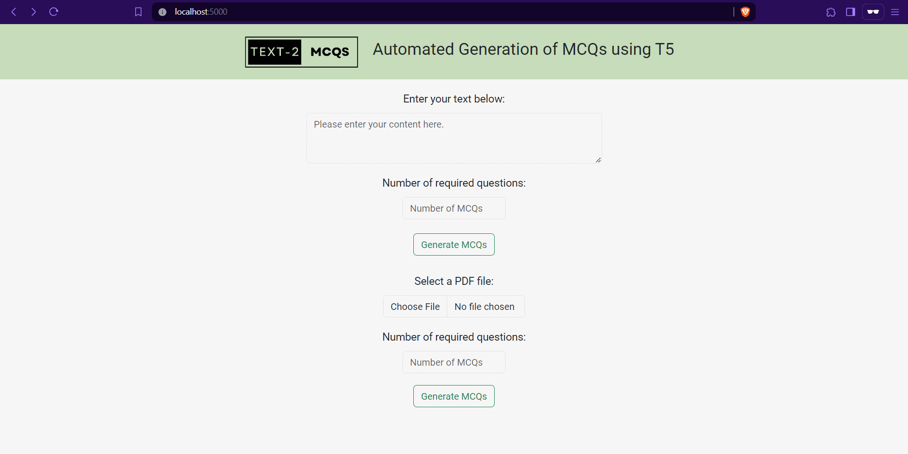

# Minor-Project-T5-Transformers-MCQ-Generation
#### Multiple Choice Questions Generation using T5 Transformers.

This project focuses on generating multiple-choice questions (MCQs) using T5 Transformers. 
Two T5-small models have been fine-tuned. One has been fine-tuned on the SQuAD dataset for question-answer pair generation. And the other has been fine-tuned on the RACE dataset for generation of distractors (wrong answers).


## Features 🚀
- Utilizes two instances of fine-tuned T5 transformers, one for Question-Answer Pair Generation and the other for Distractors Generation.
- Also utilizes Sense-2-Vec to generate additional distractors in-case of insufficient number of distractors.
- Generates MCQs based on the input text.
- Also, provides a feature for inputting text directly through a PDF file.
- A web-interface built using Python Flask for easy interaction of users with the model.
- If you would like to train the models yourself, the training scripts are available [here.](./training_scripts)

## Pre-requisites 📋
- This project has been built using the Python 3.8 and the packages associated with Python 3.8. So, if any problems arise while using newer Python version, please consider using a virtual environment using Python 3.8 and try again.

## Screenshots / Demo 📸

*Home Screen → Input Text → Generating... → Results Page*

**Image: Demo of our project**
## Usage and Installation 🛠️
#### 1. Clone the repository
```
git clone https://github.com/Tangsang2003/Minor-Project-T5-Transformers-MCQ-Generation.git
```
```
cd Minor-Project-T5-Transformers-MCQ-Generation
```
#### 2. Install Dependencies
```commandline
pip install -r "requirements.txt"
```
#### 3. Download and configure ML models
- Go to "./app/ml_models"
- You will find directories for each models that you need to configure.
- Follow the links and steps provided in the README file available in the subdirectories of the 'models' directory, i.e. `./app/ml_models/<subdirectory>`
- Or, Directly download [T5 fine-tuned on SQuAD for Question-Answer Pair Generation here](https://drive.google.com/file/d/1xMUmYbwSxGQoEeUSm95KyOKPei_DmEml/view?usp=drive_link), unzip and place it in `./app/ml_models/question_generation/models`.
- Download [T5 fine-tuned on RACE dataset for Distractor here](https://drive.google.com/file/d/1tXHVmXkSLz5qFoDTnAQ17oBDvMXE0YnC/view?usp=drive_link), unzip and place in `./app/ml_models/distractor_generation/models`.
- Download [s2v-2015 here](https://github.com/explosion/sense2vec/releases/download/v1.0.0/s2v_reddit_2015_md.tar.gz), unzip and place `s2v_old` folder in `./app/ml_models/sense2vec_distractor_generation/data`
#### 4. Run Application
```commandline
python mcq_app.py
```
*Note: You can use the main.py file to check out the very basic implementation.*

*Also, try using Python 3.8 if newer version Python throws dependency errors while pip installing the packages.*

## Contributing 🤝
If you'd like to contribute to this project, please follow these steps:
1. Fork the repository.
2. Create a new branch for your feature: `git checkout -b feature-name`.
3. Commit your changes: `git commit -m 'Add some feature'`.
4. Push to the branch: `git push origin feature-name`.
5. Submit a pull request.

## Future Works? 🌟
- Maybe, deploy the application somewhere.
- Add edit, save and export feature by integrating with a database.
- Integration with a database would also help create more refined and higher quality dataset specifically for MCQ generation, covering diverse range of topics.
- Maybe, optimize the GUI hehe.
- We also have plans to create custom datasets for very specific subjects and fine-tune the model on that, etc, etc. 
- Maybe, we won't do anything at all. 
- Bye! Thanks for checking out. ❤️️😁


